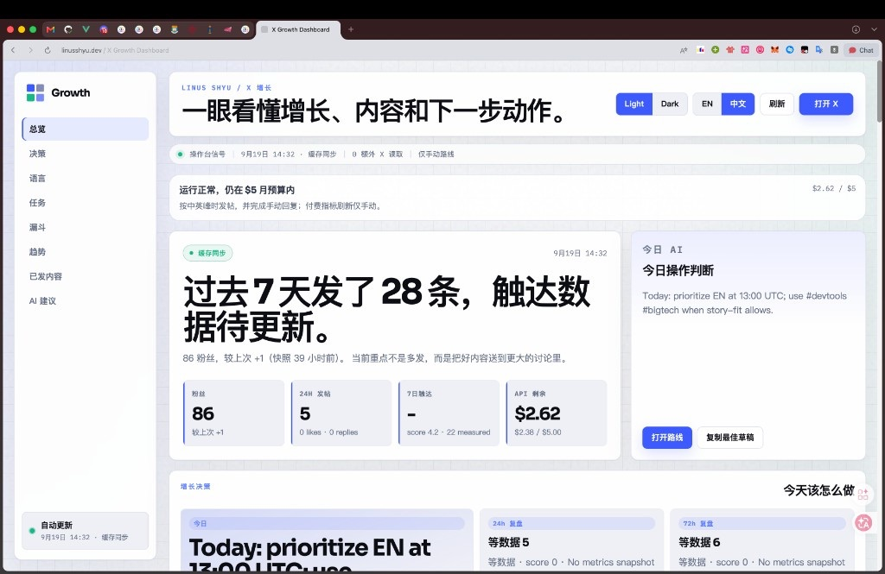
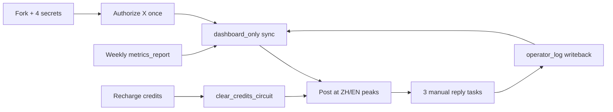

# XGrowth

<p align="center">
  <strong>Open-source autonomous growth engine for X (Twitter)</strong><br/>
  Zero-waste API spend · bilingual peak posting · self-evolving hooks · live dashboard
</p>

<p align="center">
  <a href="https://github.com/Linus-Shyu/XGrowth/actions/workflows/ci.yml"></a>
  <a href="LICENSE"></a>
  <a href="CODE_OF_CONDUCT.md"></a>
  <a href="https://linusshyu.dev/xbot-dashboard/"></a>
  <a href="https://github.com/Linus-Shyu/XGrowth/discussions"></a>
  <a href="https://x.com/Linus_Shyu"></a>
</p>

XGrowth is a GitHub Actions–hosted growth control plane for X: topic ranking → hook generation → peak posting → metric writeback → strategy evolution.

It is designed for a hard **$5 / month X API** budget with **zero automatic paid reads**.

> 中文一句话：用 GitHub Actions 跑的 **X 增长操作系统**——不是“多发”，而是把每一次写入变成可学习的增长实验。

**Live dashboard:** [linusshyu.dev/xbot-dashboard](https://linusshyu.dev/xbot-dashboard/)  
**Author:** [Linus Shyu](https://linusshyu.dev/portfolio/)

<p align="center">
  
</p>

> [!NOTE]
> Looking for help, ideas, or fork showcases? Use [Discussions](https://github.com/Linus-Shyu/XGrowth/discussions).  
> Security / secret leaks belong in [SECURITY.md](SECURITY.md), not public issues.

## Table of contents

- [Why this exists](#why-this-exists)
- [Core concepts](#core-concepts)
- [Get started](#get-started)
- [Architecture](#architecture)
- [$5 / month success path](#5--month-success-path)
- [Defaults that matter](#defaults-that-matter)
- [Repository layout](#repository-layout)
- [Live demo artifacts](#live-demo-artifacts)
- [Contributing](#contributing)
- [Security](#security)
- [Acknowledgements](#acknowledgements)
- [License](#license)

## Why this exists

Most “AI Twitter bots” burn quota on search/read APIs, post generic news rewrites, and never close the learning loop.

| Principle | What it means |
|---|---|
| **Zero-read growth** | Prefer RSS + cached analytics over paid X search/read |
| **Credits-aware** | Local budget runway + real `402 credits depleted` circuit breaker |
| **Format bandit** | Bias toward proven hooks with controlled exploration |
| **Bilingual peaks** | ZH / EN tracks at data-backed UTC windows |
| **Operator console** | Manual reply routes when automation should not spend credits |
| **Public proof** | Growth reports + live dashboard, not screenshots-only marketing |

If you want a black-box spam machine, this is not it.  
If you want an **inspectable growth lab** on GitHub Actions — fork it and run the `$5` path below.

## Core concepts

1. **Compose loop** — rank RSS / notes, allocate format, quality-gate, publish only when cadence / runway / credits allow.
2. **Learning loop** — optional metrics backfill; evolve `growth-strategy.json` only when measured `n ≥ TWEET_GROWTH_MIN_SAMPLES`.
3. **Operator loop** — browser paste routes when automation should not spend credits.
4. **Dashboard sync** — `dashboard_only` rebuilds public JSON with **0 X reads**.

Explore [`docs/ARCHITECTURE.md`](docs/ARCHITECTURE.md) and the [`examples/`](examples) directory for sanitized samples.

## Get started

### 1. Fork & clone

```bash
git clone https://github.com/Linus-Shyu/XGrowth.git
cd XGrowth
```

### 2. Configure GitHub Actions secrets

Repo → **Settings → Secrets and variables → Actions**

| Secret | Purpose |
|---|---|
| `OPENAI_API_KEY` | DeepSeek / OpenAI-compatible key |
| `X_CLIENT_ID` | X OAuth 2.0 client id |
| `X_CLIENT_SECRET` | X OAuth 2.0 client secret |
| `X_OAUTH2_REFRESH_TOKEN` | User-context refresh token |

Optional: `PEXELS_API_KEY` only if you enable images.

> [!IMPORTANT]
> Do **not** use an app-only Bearer token. Posting requires user-context OAuth with  
> `tweet.read tweet.write users.read offline.access`.

### 3. Authorize X once

```bash
cp .env.oauth.local.example .env.oauth.local
# fill X_CLIENT_ID / X_CLIENT_SECRET
./.github/scripts/authorize-x.sh
```

Put the resulting refresh token into `X_OAUTH2_REFRESH_TOKEN`.

### 4. Enable schedules (after secrets)

Public template ships **dispatch-only** workflows so forks don’t fail without keys.  
After secrets are set, uncomment the cron block in `.github/workflows/growth-maintenance.yml`:

```yaml
schedule:
  - cron: "10 */2 * * *"   # free dashboard_only
  - cron: "20 23 * * 0"    # weekly metrics_report (~$0.05)
```

And enable posting windows in `.github/workflows/blank.yml`.

Recommended posting windows (UTC) — language is locked to each slot:

```text
ZH: 12          # Beijing 20:00 evening prime
EN: 13, 16, 21  # US East morning / lunch / evening commute
```

### 5. Run self-tests locally

```bash
TWEET_SELF_TEST=local_fallback node .github/scripts/post-tweet.mjs
TWEET_SELF_TEST=cost_governor node .github/scripts/post-tweet.mjs
TWEET_SELF_TEST=learning_loop node .github/scripts/post-tweet.mjs
node .github/scripts/validate-dashboard-data.mjs --self-test
```

## Architecture

```text
RSS / Build-in-public notes
        │
        ▼
  Story ranking + verdict cache
        │
        ▼
  Format allocation (prediction / decision_rule / brutal_truth / …)
        │
        ▼
  LLM draft + quality gate
        │
        ├─ credits / runway / cadence OK ──► create post (X write)
        │                                         │
        │                                         ▼
        │                                   archive + analytics
        │                                         │
        └─ blocked ──► skip / manual route console ◄─┘
                              │
                              ▼
                     growth-strategy evolve (n≥10)
                              │
                              ▼
                     public dashboard JSON
```

Core script: [`.github/scripts/post-tweet.mjs`](.github/scripts/post-tweet.mjs)

## $5 / month success path

Designed to work on a hard **$5 X API** monthly cap with **almost-zero automatic paid reads**.

| Do this | Cost | Notes |
|---|---|---|
| Fork → secrets → authorize once | $0 | Steps 1–3 above |
| Keep maintenance on `dashboard_only` | **$0** | Rebuilds reports + dashboard from cache |
| Post only in peak slots (ZH `12`, EN `13/16/21` UTC) | write only | Language is slot-locked |
| Complete **3 manual route replies** from the dashboard Tasks panel | **$0** | Browser paste; no X search/read API |
| Fix active-conn count with `TWEET_FOLLOWERS_OVERRIDE` | **$0** | Never auto-run `USER_ME` just to refresh the number |
| Keep weekly control arm = `decision_rule` | $0 extra | Treatment formats compare against this baseline |
| Weekly auto `metrics_report` (Sun 23:20 UTC) | **~$0.05** | One batched tweet-metrics lookup; fills reach/likes on the board |
| Extra `live_snapshot` / `metrics_report` | paid | Only when you consciously spend remaining credits |
| After recharging X credits | **$0** | Actions → `growth maintenance` → `clear_credits_circuit` |
| Log today's completed reply tasks | **$0** | Dashboard → Copy operator log → Actions → `operator_log` |



Default guardrails shipped for this budget:

- `X_API_MONTHLY_BUDGET_USD=5`
- `X_API_BUDGET_SAFETY_RATIO=0.85`
- `DASHBOARD_EXPERIMENT_POST_SLOTS=2`
- `TWEET_WEEKLY_CONTROL_FORMAT_ID=decision_rule`
- `TWEET_ACCOUNT_SNAPSHOT_ENABLED=false` (followers via override)
- `TWEET_METRICS_MAX_POSTS=15` (one weekly lookup)
- Hotspot radar / auto-reply remain **off**

If credits return `402`, the dashboard forces available remaining to `$0` and the Tasks panel still gives you a zero-read day plan.

## Defaults that matter

| Knob | Public default | Why |
|---|---|---|
| `X_API_MONTHLY_BUDGET_USD` | `5` | Hard monthly spend ceiling |
| `X_API_BUDGET_SAFETY_RATIO` | `0.85` | Leave headroom under the $5 cap |
| `TWEET_WEEKLY_CONTROL_FORMAT_ID` | `decision_rule` | Fixed weekly control arm |
| `TWEET_FOLLOWERS_OVERRIDE` | `86` | Free active-conn correction |
| `TWEET_CONTENT_FORMAT_IDS` | `prediction,decision_rule,brutal_truth,sharp_question` | Match measured winners |
| `TWEET_FORMAT_BASE_ALLOCATION` | `0.65 / 0.20 / 0.12 / 0.03` | Stable mix, not vibes |
| `TWEET_GROWTH_MIN_SAMPLES` | `10` | Stop fake “self-evolution” |
| `TWEET_IMAGE_ENABLED` | `false` | No image spend until ROI exists |
| `TWEET_AUTO_REPLY_*` | off / 0 | Credits go to posts + metrics |
| `TWEET_OSS_PROMO_*` | on / ~28% / score≥170 | Occasional repo footer without burning reads |
| `TWEET_MAINTENANCE_MODE` | `dashboard_only` | Free dashboard publish; weekly cron switches to `metrics_report` |
| `TWEET_ACCOUNT_SNAPSHOT_ENABLED` | `false` | Skip USER_ME; use `TWEET_FOLLOWERS_OVERRIDE` |
| `TWEET_METRICS_MAX_POSTS` | `15` | One weekly batched metrics lookup (~$0.05) |
| `X_API_CREDITS_CIRCUIT_BREAKER_ENABLED` | `true` | Survive real `402` |

## Repository layout

```text
.github/
  scripts/           # posting, OAuth, dashboard validators
  workflows/         # CI self-tests + optional posting/maintenance
  config/            # RSS feed list
  content/           # build-in-public JSONL seeds
examples/            # sanitized analytics + post samples
reports/             # latest public growth artifacts (demo)
docs/                # architecture notes + images
```

## Live demo artifacts

- Dashboard: https://linusshyu.dev/xbot-dashboard/
- Strategy snapshot: [`reports/growth-strategy.json`](reports/growth-strategy.json)
- Growth report: [`reports/growth-report.md`](reports/growth-report.md)
- Sample analytics: [`examples/tweet-analytics.sample.json`](examples/tweet-analytics.sample.json)
- Changelog: [`CHANGELOG.md`](CHANGELOG.md)

## Roadmap (help wanted)

- [ ] First-class one-click template repo
- [ ] Pluggable LLM providers beyond OpenAI-compatible APIs
- [ ] Verified media attachment audit (planned vs attached)
- [ ] Multi-account workspace mode
- [ ] Browser extension for one-click “paste route reply”

Open an issue with label `good first issue`, or start a [Discussion](https://github.com/Linus-Shyu/XGrowth/discussions).

## Contributing

See [CONTRIBUTING.md](CONTRIBUTING.md) for setup, self-tests, and PR expectations.  
By participating, you agree to the [Code of Conduct](CODE_OF_CONDUCT.md).

Support channels are listed in [SUPPORT.md](SUPPORT.md).

## Security

- Never commit `.env.oauth.local`, refresh tokens, or `.github/runtime/*`
- Rotate X client secrets if they ever leaked
- Treat growth reports as public analytics — strip anything private before publishing forks

See [SECURITY.md](SECURITY.md).

## Acknowledgements

XGrowth builds on the open tooling ecosystem, especially:

- [Node.js](https://nodejs.org/) and [Bun](https://bun.sh/)
- [GitHub Actions](https://github.com/features/actions)
- OpenAI-compatible chat APIs (DeepSeek / OpenAI and others)
- The X API v2 OAuth 2.0 user-context flow

We're committed to keeping XGrowth an open, inspectable growth lab so others can fork the `$5` path and improve the learning loop in public.

## License

[MIT](LICENSE) © 2026 Linus Shyu

---

<p align="center">
  <a href="https://github.com/Linus-Shyu/XGrowth">⭐ Star XGrowth on GitHub</a>
  ·
  <a href="https://github.com/Linus-Shyu/XGrowth/discussions">Join Discussions</a>
  ·
  <a href="https://linusshyu.dev/portfolio/">View Linus Shyu’s portfolio</a>
</p>
